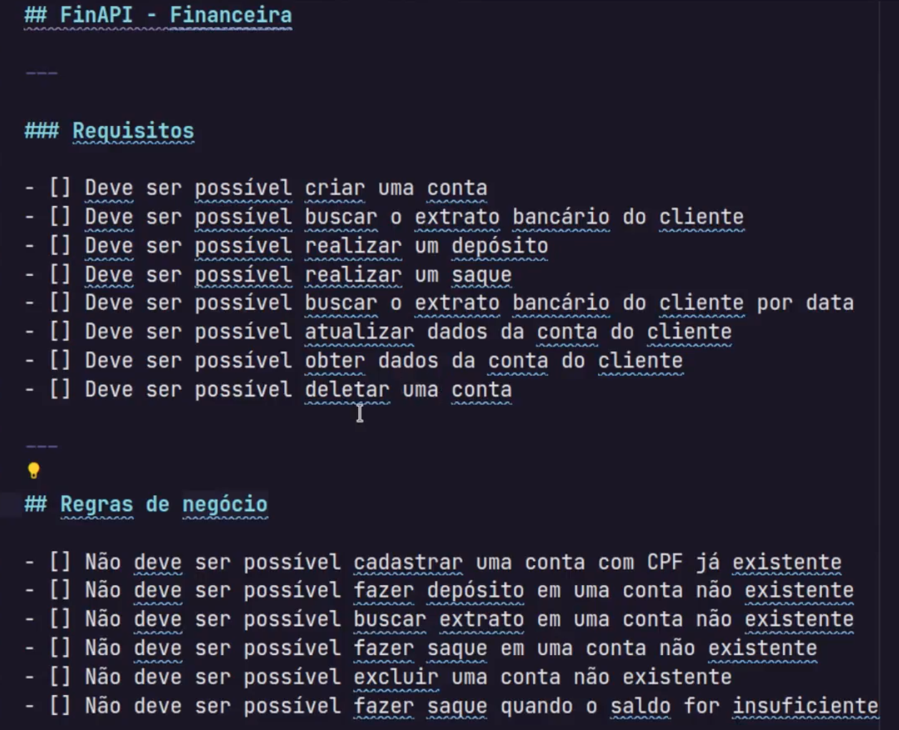

# FinAPi - Financeira 

## Requisitos: 
- Analista vão de dar uma documentação para você desenvolver uma tarefa
- Tudo aquilo que nosso sistema precisa fazer 

## Regras de 
- Vão dar um norte pra nossa aplicação 

## Parâmetros
- cpf: string
- name: string
- id: uuid 
- statement: [] // nosso extrato 

- `yarn add uuid `

## Middlewares: 
- Uma função que fica entre nosso request e nosso response 
- Serve para fazer: validação de um token, verificar se o usuário é um admin ou não, validações # ignite-node-02-primeiro-projeto
